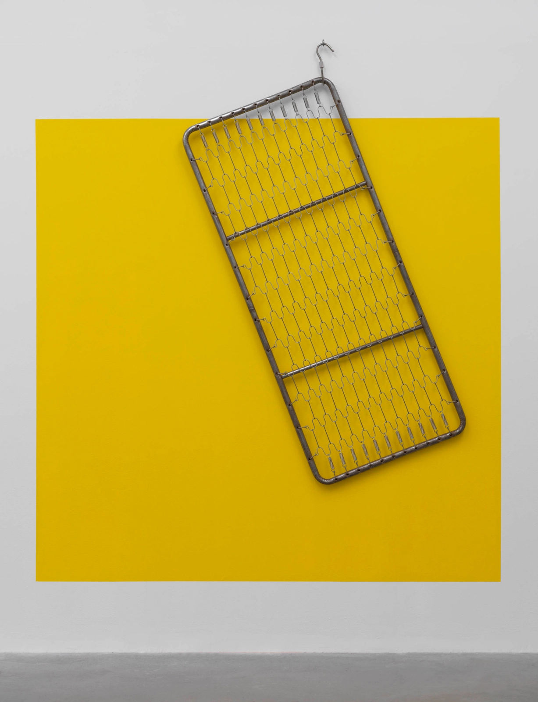

ARTIST ROOMS gives young people across the UK the chance to get involved in creative projects, discover more about art and artists, and learn new skills.

The ARTIST ROOMS programme and collection is managed by Tate and National Galleries of Scotland with the support of Art Fund, Henry Moore Foundation and using public funding by the National Lottery through Arts Council England and Creative Scotland. Its founding collection was established through The d'Offay Donation in 2008 with the assistance of the National Heritage Memorial Fund, Art Fund and the Scottish and British Governments.

ARTIST ROOMS is a collection of international modern and contemporary art, established through one of the largest and most imaginative gifts of art ever made to museums in Britain. It is owned on behalf of the United Kingdom by the National Galleries of Scotland and Tate, who together care for the Collection and arrange for its presentation across the country.

The d'Offay Donation was made in 2008, with the assistance of the National Heritage Memorial Fund (NHMF), Art Fund and the Scottish and British governments.

The Artist Rooms Foundation is a charity dedicated to promoting art for the benefit of the public, and to support the aims and activities of ARTIST ROOMS.

[ARTIST ROOMS](/) On Tour is supported by the National Lottery through Arts Council England, Art Fund, and in Scotland, the National Lottery through Creative Scotland.

_Since 2009, nearly 60 million visitors have passed through the doors of ARTIST ROOMS._

_211 exhibitons have been shown at 95 museums and galleries across the United Kingdom to date._

_Some 800,000 young adults and children have learned about art through the learning programmes offered._
